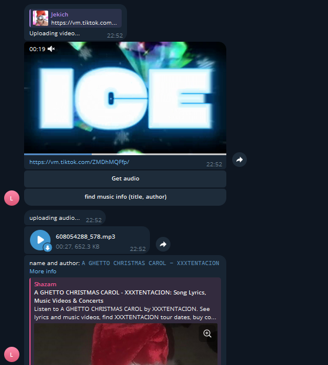

# TikTok Media Processor & Recognition Bot

A high-performance media processing tool that bridges asynchronous audio recognition with automated filesystem management for Telegram.



## Technical Highlights

* **Asynchronous Integration:** Leveraging `asyncio` for the Shazam recognition engine allows the bot to handle high-latency API requests efficiently.
* **Advanced Media Processing:** Utilizing a hybrid approach with `yt-dlp` for stream capturing and `FFmpeg` for extracting audio layers and re-encoding them into high-quality MP3 (192kbps).
* **Resilient Error Handling:** Implemented a robust multi-layered exception handling system to manage network timeouts, conversion failures, and unsupported media types.
* **Security-First Design:** Sensitive credentials are encapsulated using environment variables via `python-dotenv`.
* **Automated Lifecycle Management:** Built-in resource cleanup routines ensure the server's filesystem remains pristine by purging temporary media artifacts immediately after delivery.

## Tech Stack

* **Language:** Python 3.10+
* **Bot Framework:** pyTelegramBotAPI (Telebot)
* **Media Core:** yt-dlp, FFmpeg
* **Recognition:** Shazamio (Asynchronous Shazam API)
* **Environment:** python-dotenv

## Project Structure

```text
├── main.py           # Main bot logic and handlers
├── .env              # Private API tokens (Hidden)
├── .gitignore        # Rules for Git (Excludes .env and venv)
├── LICENSE           # MIT License file
├── README.md         # Documentation
├── ffmpeg.exe        # Multimedia framework (Windows)
└── ffprobe.exe       # Multimedia streams analyzer
```
## Installation & Setup
### 1. Install Dependencies
```Bash

pip install pyTelegramBotAPI yt-dlp shazamio python-dotenv
```
## 2. FFmpeg Configuration
Place `ffmpeg.exe` and `ffprobe.exe` in the project root directory or ensure they are available in your system's PATH.

## 3. Environment Variables
Create a `.env` file in the root directory and add your bot token:
```Bash
API_TOKEN=your_telegram_bot_token_here
```
## 4. Run the Application
```Bash

python main.py
```
## Future Improvements
* Asynchronous Migration: Transitioning to aiogram for superior concurrency and production-grade stability.

* Database Integration: Adding PostgreSQL or Redis for user analytics and intelligent result caching.

* Dockerization: Containerizing the application for seamless, one-click multi-platform deployment.

* Queue Management: Implementing task queues (e.g., Celery) to handle heavy media processing workloads in the background.

## License
This project is licensed under the MIT License - see the LICENSE file for details.